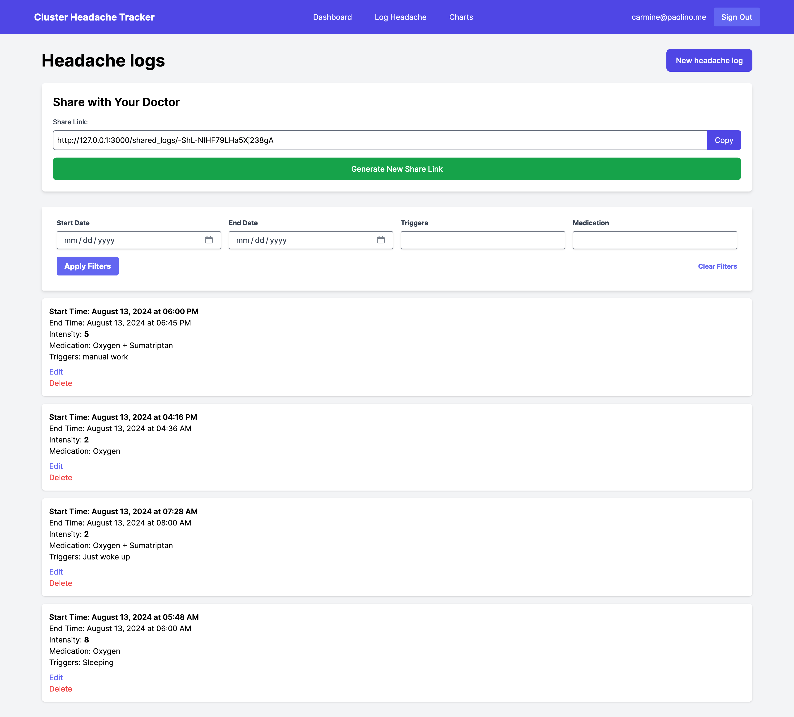
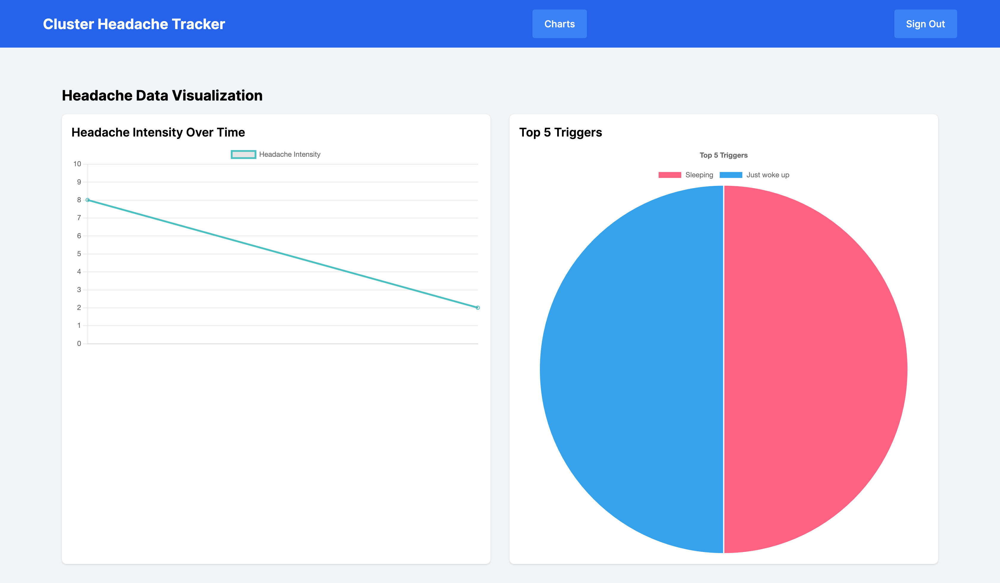

# 🧠 Cluster Headache Tracker

Cluster Headache Tracker is a free, open-source web application designed to help individuals suffering from cluster headaches track and manage their condition. By providing detailed logging, visual insights, and easy sharing with healthcare providers, this tool aims to improve the understanding and treatment of cluster headaches.




## ✨ Features

- 📝 **Detailed Logging**: Record intensity, duration, triggers, and medications for each headache episode.
- 📊 **Visual Insights**: Gain valuable insights with interactive charts and graphs showing your headache patterns over time.
- 🩺 **Share with Doctors**: Generate shareable reports to collaborate effectively with your healthcare providers.
- 💾 **Data Import/Export**: Easily import and export your headache logs in CSV format for backup or analysis.
- 🔒 **Secure & Private**: Your health data is encrypted and stored securely, with full control over sharing.
- 🕵️ **Privacy-Focused**: We don't store any personally identifiable information. Users are identified by a username, not an email address.
- 🇩🇪 **EU-Based**: Our servers are hosted in Germany, ensuring compliance with strict EU data protection regulations.
- 📱 **Mobile Friendly**: Access your tracker on any device with our responsive, mobile-friendly design.
- 🌟 **Open Source**: Contribute to the development and customize the tracker to fit your needs.

## 🚀 Getting Started

Visit [https://clusterheadachetracker.com](https://clusterheadachetracker.com) to create a free account and start tracking your cluster headaches.

## 💻 Development Setup

### Prerequisites

- Ruby 3.3.4
- PostgreSQL

### MacOS Setup

1. Install required tools:

   ```
   mise use -g ruby
   brew install postgresql 1password-cli
   brew services start postgresql@14
   ```

2. Clone the repository:

   ```
   git clone https://github.com/crmne/cluster_headache_tracker.git
   cd cluster_headache_tracker
   ```

3. Set up the database:

   ```
   op vault create cluster_headache_tracker
   op item create --vault=cluster_headache_tracker --category=login --title="local pg" --generate-password username=cluster_headache_tracker
   echo "export CLUSTER_HEADACHE_TRACKER_DATABASE_PASSWORD=\"$(op item get "local pg" --vault "cluster_headache_tracker" --fields label=password)\"" >> .envrc
   direnv allow
   echo $CLUSTER_HEADACHE_TRACKER_DATABASE_PASSWORD | bin/pg_add_user.sh cluster_headache_tracker
   rails db:create
   rails db:migrate
   ```

4. Start the development server:

   ```
   bin/dev
   ```

Visit `http://localhost:3000` to see the application running locally.

## 🤝 Contributing

We welcome contributions! Please see our [Contributing Guide](CONTRIBUTING.md) for more details on how to get started.

## 📄 License

Cluster Headache Tracker is released under the [GNU General Public License v3.0 (GPL-3.0)](LICENSE). This license ensures that the software remains open source and that any modifications or derived works are also released under the same license. See the LICENSE file for more details.

## 🔒 Privacy

We take your privacy seriously. Cluster Headache Tracker does not collect or store any personally identifiable information. Users are identified by a username only, not an email address. All data is stored on servers located in Germany, ensuring compliance with strict EU data protection regulations.

## ☕ Support the Project

While Cluster Headache Tracker is free to use, your support helps keep it running and improving. If you find this tool valuable, please consider making a donation:

[Buy Me a Coffee](https://buymeacoffee.com/crmne)

Your support is greatly appreciated and helps ensure the continued development and maintenance of this project.

## 🆘 Support

If you encounter any issues or have questions, please [open an issue](https://github.com/crmne/cluster_headache_tracker/issues) on GitHub.

## 🙏 Acknowledgements

Thank you to all the contributors and users who help make this project better every day.
